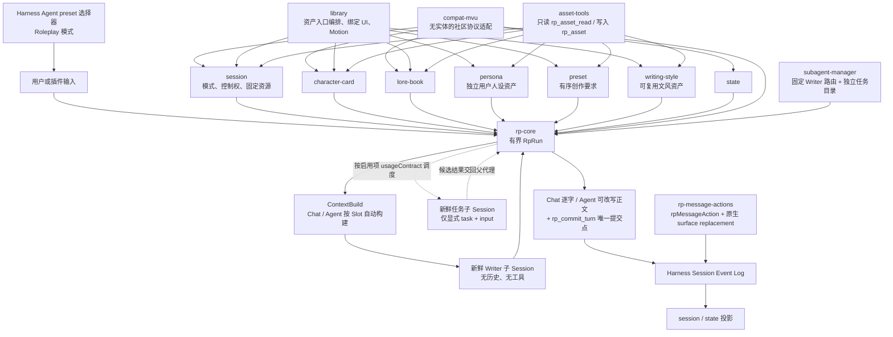
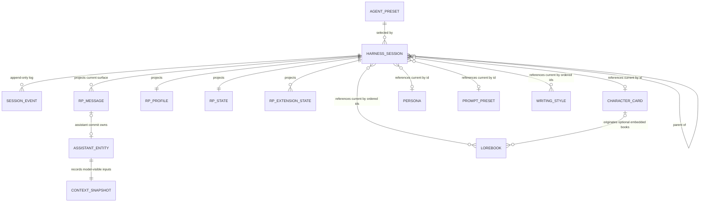
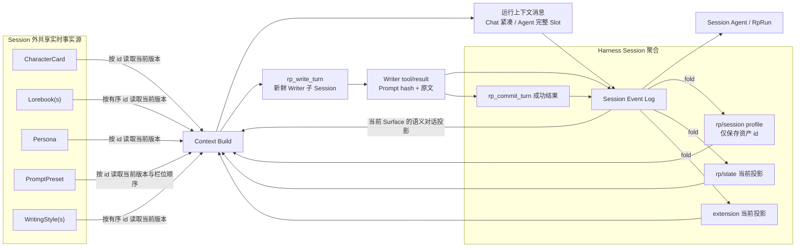

# Roleplay 插件体系

## 产品边界

Roleplay 直接建立在 Harness 原生会话与 Agent 能力之上。外部资料格式只在导入和领域算法边界转换；对话事实、Agent 多步执行、工具生命周期、压缩、回放和 fork 均使用 Harness 原生能力。

与普通 chatbot 的关键区别是：每个叙事回复都必须先经过系统固定的新鲜 Writer 子 Agent。Chat 与 Agent 都使用 Session Slot 自动准备 ContextBuild；Chat 由运行时把 Writer 成稿直接写入父会话的原生助手流，父 Agent 不再复制或改写正文，Agent 的父 Agent 是唯一编排者，可以修改 Writer 初稿，并按本轮启用目录中各项 `usageContract` 调用任务子代理。契约可以声明相对 Writer 的前置、后置或可选任务；子代理接收父代理显式提供的 `task` 与 `input`，本轮用户图片附件则以原生 durable image block 自动透传，不能替换 Writer 或自动交付回复。执行模式不改变 Writer 上下文所有权。普通讨论由父 Agent 直接回复，共享资料读取调用 `rp_asset_read`；仅在会话变量启用时提供 `rp_state_read`。资料写入只在 Agent 模式调用 `rp_asset`，叙事正文之后才允许调用 `rp_commit_turn` 提交副作用。

### Chat 与 Agent 执行模式

`rp/session.runtime.executionMode` 是 Session profile 的一部分，与 `adaptive|actor|director` 参与方式正交。Header 开关仅在 Agent 空闲时通过 revision CAS 改写该字段：

| 执行模式 | 模型可见能力 | 默认 step 上限 | 目标体验 |
|---|---|---|---|
| `chat` | Writer 已就绪状态；`rp_write_turn`、`rp_commit_turn`、`rp_asset_read`，以及会话变量启用时的 `rp_state_read` | 5 | Session 按可编辑 Slot 自动冻结扁平 Writer Prompt；已启用能力只读；运行时将 Writer 原文直接流式交付；正常路径仍为两步，另外三步覆盖 Writer 与提交失败后的恢复 |
| `agent` | 完整只读 Slot、Writer 已就绪状态、启用子代理目录；`rp_write_turn`、`rp_run_subagent` 与 preset 工具 | 20 | 使用同一 Session Slot；父 Agent 先分流请求，再按每项 `usageContract` 编排，可向 Writer 传入 brief 并修改初稿 |

### 系统提示词所有权与注入顺序

提示词按“Harness 基础身份、Roleplay 通用规则、当前模式工作流、本轮输入、可用工具”分层，避免把具体角色流水线复制进 persona、运行时和前端。`rp-core/src/prompts.js` 是 Roleplay 通用规则、Chat/Agent 工作流、正文写作规则、首步输入、独立任务输入及 RP 工具说明的公共渲染入口；Standard 只负责把通用规则写入受管理 preset。Agent 的稳定通用规则只解释如何读取可插拔 `usageContract`，不认识“规划”“润色”等具体节点。任务子代理的目录服务把用户工作指令原样作为完整 persona；名称和调用契约承担选择、必需性、顺序、输入及结果用途，具体 task 与 input 作为单独 User 输入。新鲜上下文、工具白名单、递归深度与写入边界由 Core 运行时保证，不重复写入子代理 System。Core 在每轮准备时只冻结启用目录投影。

| 模型角色 | System 层 | User 层 | Tools 层 |
|---|---|---|---|
| Chat 父代理 | Harness 身份 → Roleplay 通用规则 → Chat 模式工作流 → 当前可见工具的指导段 | 原生可见对话 → 紧凑 `<roleplay_request>`、绑定清单与提交素材 | Chat 掩码后的只读工具、Writer 与 commit |
| Agent 父代理 | Harness 身份 → Roleplay 通用规则 → Agent 通用分流与契约调度 → 当前可见工具的指导段 | 原生可见对话 → `<roleplay_request mode="agent">`、启用目录与完整只读上下文 | 当前 preset 工具、Writer、commit 与启用任务子代理 |
| Writer | Harness 身份 → 仅正文写作规则；不叠加主对话通用规则与模式工作流 | 完整 Slot 文档；Agent 可在末尾追加一个有界 writing brief | 空白名单 |
| 自定义任务子代理 | Harness 身份 → 用户工作指令原文；不添加组织关系或运行时限制壳 | 单条 `<task_input>`，包含本次明确传入的 task 与 JSON input；其后保留本轮用户图片 block | 该目录项 allow-list 与实际已安装工具的交集 |

首步输入由同一个 `renderRoleplayRequest()` 生成。`<roleplay_request mode>` 内先给出 `<request_policy>`，要求父 Agent 区分讨论／澄清、共享资料操作、叙事续写和混合请求；绑定放入显式 JSON 标签。Agent 模式始终带 `<specialist_catalog format="json">`，每项用 `usageContract` 而不是含义模糊的 `description` 暴露完整调度契约；空目录也明确写为 `[]`。完整父代理上下文位于只读 `<roleplay_context>`，其中 `<context_guide>` 解释 `<section name>`、`<item name>`、无标签 Slot 以及规则／事实／历史／State／当前输入的不同语义，实际 Slot 文本由 `<roleplay_content>` 包裹。该父代理包装不改变 Writer 的扁平 Prompt。目录 JSON 会编码可伪造控制标签的尖括号，Slot 正文中的请求外层控制标签也会被转义；正常 `<section>`、`<item>` 与资料自有语义标签保持不变。

工具 schema 由 Harness 在每个请求中生成；Core 的 scoped `system-prompt/assemble` 监听器在后续贡献完成后，删除所有没有同名可见 schema 的 `tool:<name>` 段。因此工具权限、工具说明和执行入口保持一致，Chat、Writer 或任务子代理不会收到自己无法调用的工具指导。Roleplay 设置的“提示词”页签调用同一组 renderer 和子代理 runtime profile，并从当前 Harness `SystemPrompt` 注册表读取实际 `harness:identity`；对话、资料与最终 schema 仍标为动态来源。它不是 Session 事实源，也不读取某次对话的私有正文。

两种模式共用同一套原料注册、Session Event Log、Session `contextBuild`、effect 校验、Writer、`current_asset_bindings` 和提交协议；差异包括父 Agent 能力、资料库读取范围，以及 Writer 初稿是否允许改写。`contextBuild` 是 Session profile 内的 slot/source-ID 布局与组装格式；两种模式都在运行开始前按该设置冻结 Writer 上下文。Chat 父 Agent 收到紧凑就绪标记、绑定清单，以及明确声明 `parentDelivery: commit` 的提交专用只读素材；完整 Slot 正文仍不向 Chat 父 Agent 展开。Context Source 可为该素材提供独立 `parentText`：`text` 始终是 Writer 与 Prompt 工作台看到的正文，`parentText` 只进入父 Agent 的 `<commit_context>`；未提供时沿用 `text`。标准组合只有 `rp.state` 使用双视图：Writer 侧只包含 namespace 名称、说明和当前值，revision、更新协议、Schema、rules 与 diagnostics 留在提交视图。Agent 父 Agent 收到完整的 Writer 侧只读 Slot 文档和同一份提交专用素材，用于判断委派、工具、Writer 与最终 effect，但不能选择、遗漏、重排或重新组装 Slot。绑定清单只包含 `characterId`、`lorebookIds`、`personaId`、`presetId` 和 `writingStyleIds`：单项未绑定用 null，有序多项未绑定用空数组，不携带 status、scope 或每个世界书条目。Chat 的 `rp_asset_read` 在执行层以该 profile 为权限边界，`list` 只列当前绑定，`get` 拒绝未绑定 ID；Agent 可用 `rp_asset_read` 浏览完整共享资料库，但全库可见资产不得被推断为当前已绑定。Agent 完成 `rp_asset` 写入后，运行时按同一 Session Slot 自动刷新并在工具结果中返回更新后的完整上下文。`rp.conversation-summary` 只投影当前 Surface 上 active checkpoint 对应的总结；没有 checkpoint 时 source 不可用，也不生成标签或占位。`rp.conversation` 会把当前 Surface 投影成纯语义对话正文，排除当前输入、checkpoint、工具轨迹、旧 snapshot、推理和中间助手消息；没有历史时不生成空提示。两份正文分别以前置英文 context note 标明“较早对话的压缩记录”与“保留原文的可见对话”，并明确冲突时以更新的对话历史为准。会话总结、对话历史与 `rp.current-input` 都是必须启用但可以调整位置的独立 source；当前输入在两种模式的 Slot 中恰好出现一次。ContextBuild 不再生成最外层 `<roleplay_context>`。每个 `contextBuild.slots[].sectionTag` 默认为 `true`；启用的 Slot 序列化语义化 `<section name>`、多来源分组的 `<item name>` 和边界安全的来源正文，关闭的 Slot 不生成或转义这些标签，只按 source 顺序拼接原文。不同 Slot 可以混合两种格式；两种格式都不携带 slot/source ID、revision、hash、绑定、默认位置或运行参数，也不创建任意的 Director Context；`<commit_context>` 只承载声明过的提交素材。所有启用且当前可用的 Slot 都会原样进入 Writer Prompt；Core 不按字符或估算 token 做本地裁剪，真实上下文边界由 Writer 模型提供方校验。

Context Source 可以用 `defaultSlot.sectionTag` 覆盖新 Slot 的默认分组标签值。创作预设把该默认值保存在每个栏位中：尚未保存 Prompt 布局的会话读取当前栏位默认值；Session 一旦保存自己的 `contextBuild`，后续继续保留会话内的独立调整，预设修改不会覆盖它。

Session `contextBuild.slots[]` 可以带 `idle: true`。闲置 Slot 继续保存名称、顺序、source 引用和会话自定义内容，但不会进入右侧 Prompt 预览、本轮 fragment metadata 或 Writer 组装；Chat 与 Agent 读取同一份闲置状态。Context Source 默认允许所在 Slot 闲置，`idleAllowed: false` 则要求它始终参与组装。`rp.conversation-summary`、`rp.conversation` 与 `rp.current-input` 均使用该约束，Host 按 source 身份拒绝包含任一资料的闲置 Slot，因此移动到其他分组也不能绕过。

Context Source 只有两种预算语义：`factual`（事实性）和 `instructional`（指导性）。对话历史、当前输入、角色卡、人设、世界书和状态属于事实性内容，在预算裁剪中受保护；创作预设、文风和会话自定义 Prompt 属于指导性内容，按优先级使用剩余预算。分类不改变 Session Slot：两种模式都采用用户保存的名称、顺序和组合，不再由父模型临时选择或重排。

`rp_write_turn` 在 Chat 与 Agent 中统一要求 `action: "write"`，避免用无字段对象表达启动意图；Agent 可再附加一个有界 `brief`，Chat 的 scoped schema 不暴露或接受它。该工具创建无父级历史、无工具、不可继续调用子代理的 one-shot Writer 子 Session。请求只有独立 Writer persona 和一条扁平 user Prompt；本轮用户图片 block 按原顺序附在文本之后。Writer 的模型策略来自全局子代理目录，Chat 与 Agent 共用同一项配置；“跟随父代理”沿用当前 Session 已记录请求或明确配置的 provider/model/reasoning effort，固定模型使用用户为该模型选择的推理强度，父级显式输出上限仍被继承。目录策略在 `prepareRun` 时冻结，完整 Writer 路由在本轮首次子代理执行前冻结；实际执行时缺少 provider/model 才返回配置错误。Core 不解析 Writer 的 `contextWindow`，也不在发送前估算或拒绝 Prompt；模型提供方负责最终容量校验。一个 `RpRun` 只接受一个持久化成功 Writer artifact；失败、拒绝、空输出和超限允许重试。Writer 工具结果只是父 Agent 生成提交参数的内部输入。Chat 的下一次父模型输出只调用 `rp_commit_turn`，运行时丢弃其中的正文和推理块，把 Writer 成稿以原生 `assistant/chunk` 写入同一条 `assistant/message`；Agent 的父 Agent 则可以直接修改初稿，也可以在本轮目录实际存在合适任务子代理时运行有界隔离任务并决定如何采用其结果。Chat 的纯提交模型输出由运行时与 Writer 正文合并，Agent 在完整正文之后调用 `rp_commit_turn`；commit 继续关联 Writer Session、路由、推理强度和 Prompt hash。Chat 默认最多 5 个模型 step，正常 Writer + commit 使用两个，其余三个允许 Writer 失败、提交参数纠错和提交领域校验各自恢复。

Agent 模式没有运行时硬编码的功能角色流水线。父 Agent 先读取本轮启用目录的全部 `usageContract`；契约可用自然语言声明适用范围、必需性、相对 Writer／其他工具的顺序、显式输入及结果用途。系统不新增结构化 `required` 或固定阶段字段，也不认识具体角色名称；父 Agent 通过统一的 `rp_run_subagent` 路由遵守所有适用的必需契约，失败时阻止其依赖步骤。该工具从每轮冻结的启用目录启动新鲜子 Agent，不继承父对话历史，只接收本次显式传入的完整任务与对象形式 JSON 输入，并自动附带本轮用户图片引用；工具 schema 与运行时都要求直接传对象，不接受再次 JSON 编码后的字符串。manager 提供仅在首次建目录时生效的 `initialSubagents` 种子入口；标准组合预置两个可删除、可停用的普通角色：“规划”的契约要求在 Writer 前调用并把采用的大纲整理进 brief；“润色”的契约要求在 Writer 后、最终正文和 commit 前调用并审阅完整候选稿。用户可以编辑、停用、重新启用、删除或新增任意任务角色，并为固定模型选择其 catalog 声明的推理强度。停用项保留在管理目录但不进入下一轮 runtime profile、`<specialist_catalog>` 或可调用 Map；目录变更只影响下一次 RP 运行，已经开始的 Writer 与任务子代理保持启动时配置。任务子代理不能替换 Writer、自动交付或提交最终回复，不能修改 State、共享资产或再次调用子代理。切换模式不改写 Surface、不复制会话、不重置 State，也不改变角色控制权；变化的是父 Agent 工具可见性、Agent 模式可传给 Writer 的 brief，以及父 Agent 对 Writer 初稿的修改权限，ContextBuild 始终属于 Session。

## 数据所有权与消息实体

Harness Session 是一次 RP 会话的聚合根。Session Event Log 保存 Agent preset 身份、RP profile、消息、turn/step/tool 生命周期和最终提交；`rp/session` 和 `rp/state` 都是可从该日志重建的投影。

角色卡、世界书、用户人设、创作预设和文风是 Session 外部的共享实时事实源。Session 保存资产 ID 引用，revision/hash 只承担 CAS、缓存失效、诊断和单次运行一致性检查，不固定历史资产版本。资产更新后，引用它的 Session 在下一楼层读取最新内容；旧楼层已经记录的上下文 snapshot 不被改写。创建 Session 时只确认所选预设资产存在，不读取或校验它的栏位。下一楼层按预设当前实际存在的非空栏位生成来源：稳定 field ID 展开为 `rp.preset:<field-id>`，每个栏位在 Prompt 工作台中都是可单独移动的独立分组；`position = top | bottom` 只声明首次插入默认布局时位于对话历史上方或下方的区间，同一位置内按预设顺序拼装，不要求任何固定栏位名称。Session 保存有序文风 ID 列表作为绑定事实；下一楼层把每条 live 文风展开为稳定的 `rp.writing-style:<asset-id>` 来源和独立分组，绑定顺序决定首次布局，之后由 Session 保存的 Prompt 分组顺序决定实际拼装顺序。Session profile 只作为内部配置和资源绑定事实源，不注册 Writer Slot。Prompt 默认以语义对话历史为轴心：顶部预设栏位位于角色卡之前，底部预设栏位位于重要规则之后；历史事实仍来自 Harness Surface，但会被物化进 Writer 的扁平 Prompt，主 Session 不追加第二份历史消息。

Host 浏览器资产服务和 Roleplay preset 运行时资产服务可以是不同 Cordis 实例，但必须解析到同一共享资产目录；同一进程中针对同一目录的导入、CAS 更新和删除必须进入同一串行提交队列，不能因双实例产生重复导入、revision 覆盖或第二份缓存事实源。

用户消息和助手回复都是独立的消息操作单元。`rp-core` 统一定义版本化的 `rpMessageAction` metadata 和能力无关的 surface-owned entity 折叠器，`rp-message-actions` 把操作 metadata 写在原生 `user/message` 或 `assistant/message` replacement 的 `source` 中；DSH HEAD 已有的 `surfaceOp: { op: 'replace', ... }` 与 `sourceEventSeqs` 是当前模型 surface 的唯一变更载体。插件不增加消息事件类型，也不建立第二消息仓库。用户消息不承载业务实体；成功 `rp_commit_turn` 的剧情 effect 与成功 `rp_state` 配置均由对应助手 surface 持有。普通 replacement 只迁移 entity 所有者，delete/reroll replacement 才撤销被引用的 entity；Core 不识别 State 或其他具体能力。

编辑只用同类型原生消息替换目标的当前 surface descendant：保留稳定 message id、模型来源、非文本块与既有 effect，只更新用户保存的文本，不再次运行 Roleplay 文本转换器。删除从所选可见消息开始裁剪到当前对话尾部：插件把完整目标列表写入 `rpMessageAction`，再用一个空内容的原生 `assistant/message` replacement 原子遮蔽当前 surface 后缀。这个空助手事件只是持久控制载体；DSH 的 `deriveEventMessage()` 将其投影为 `null`，因此不会把空助手消息送进后续模型历史。删除范围内所有已提交助手 entity 随 replacement ancestry 失活，领域投影据剩余活跃助手 entity 重建。

只有当前最后一条可恢复消息显示重新生成。重新生成用同类空助手 replacement 遮蔽所属 turn 及其后缀，在 `rpMessageAction.replay` 中持久保存该轮当前仍存在的全部纯文本用户原文，再投递回同一 Session 的同一 Agent；启动恢复会补投已记录但尚未进入 Inbox 的 replay，不使用空用户消息承载控制意图。失败回复以 `kind: 'turn'` 的 target 进入相同协议。复制、行内编辑、删除、重新生成、保存并重新生成、分支与指标由消息操作插件的自定义 Conversation Nodes 呈现；Portal 只把编辑器挂进对应原生消息行，`commandview` 与 `turnTail` 负责控制标记和失败入口。消息操作不创建、切换或归档其他 Session；共享资产不回退，含共享资料写入的 turn 禁止重新生成。分支继续调用 DSH 原生 `forkAt`：已提交续写以 commit result 为业务锚点，普通讨论以最终助手消息为锚点，工具型回复以该 turn 最后业务事件为锚点。

State 是 Session 私有的可变事实源，在模型上下文层与角色卡、世界书并列。`rp.state` v2 是 namespaced、带受限 Schema 与语义规则的纯 JSON；每个 namespace 包含 revision、初始值、当前值、完整 definition 与两级诊断，只接受 `state.update` 的 `set/increment/append/remove` 语义操作。namespace 只是 Session 内分区，多角色通过 `/characters/<name>/...` 路径区分，不建立角色所有权或资产别名。只读上下文来源 ID 为 `rp.state`，正文以 `namespaces[]` 给出 `namespace`、`expectedRevision`、当前值、Schema、模式、规则与诊断，不重复发送初始值。新故事由 Host RP 插件先解析当前 live 资产，再通过有序的通用 materializer 合成 profile、完整 State v2 bootstrap 与开场白，最后把 profile 命令和可选的闭合 `turn 1` 一起传给 `ctx.agents.create({ seed, setup })`；创建链路从当前空白来源 Session 读取权威 Workspace 成员关系，来源已登记时使用同一 Workspace 路径创建并登记新 Session，来源未登记时保持未分组，不按 cwd 猜测归属。协调器和 Session 不理解具体社区格式。`scene.openingSource=card|custom|skip` 记录用户选择的来源，使适配器只处理当前选中的默认、备用或自定义开场。State bootstrap 只在创建空白会话或空白会话重选开场资料时替换；进入对话后不再从共享资产重新计算。跳过开场时 seed 不含 turn，首条用户消息使用 turn 1。Agent 构造后禁止创建第一条开场，只能用原生 surface replacement 编辑或移除 seed 中已有的开场。后续 `rp_commit_turn` 更新投影，下一楼层再读取更新后的内容。

开场的可编辑源文与助手消息正文是两个不同层次：`scene.openingText` 保存可重放的源文，materializer 只可返回不持久的 `openingMessageText`。宏展开和社区控制块清理只改变后者，确保 reload 或空白会话再次保存时可以从同一源文重建 State 和相同的可见开场。

State Wiki 只读，用户明确要求配置变量后，由 Agent 模式的 `rp_state` 通过原生 `rp-state-configure` 执行 `create/update/reset/delete`。State 配置成功后立即生效，并刷新当前 Run 的完整上下文、废弃刷新前的 Writer 草稿；刷新失败会阻止继续调用 Writer 和提交剧情，但已经成功的配置仍保持生效，直到所属回复被删除或重新生成。v3 命令参数保存规范化输入、最终 canonical result，以及经助手消息、原生 `tool/call`、turn、step、工具名和 call ID 共同校验的 assistant-tool owner；只有配对的 `command/done: success` 形成配置 entity。配置 entity 的业务根是 `command/done`，surface owner 是发起 `rp_state` 的助手消息；正文编辑保留，delete/reroll 撤销。领域投影按业务根事件序号合并 bootstrap、剩余配置 entity 和剩余剧情提交 entity，从而恢复 definition、值、namespace 存在性及 revision。`stateBootstrap` 仍是会话外初始化事实，不随消息回滚。`rp/state` projection `stateVersion` 为 8；旧 v2 配置命令不迁移、不静默降级，开发会话需重建。

删除角色卡时会尽力扫描引用它的 live 与 cold Session，用于在确认弹框说明影响，并提供默认勾选的关联世界书删除项；扫描结果不参与删除授权。实际删除不恢复、不改写也不归档任何 Session，无论关联 Agent 是否正在运行都先删除共享角色卡，再尽力清理用户勾选的关联世界书。Session Event Log 中的 live 引用和已有消息、开场白、状态保持不变；上下文来源、宏、世界书激活与兼容适配器在读取时把缺失角色卡视为未绑定，下一轮不再注入已删除内容。对话可继续生成，也可由用户在后续对话中重新绑定角色卡。单独删除世界书不修改关联角色卡。

### 实体与关系

已经写入旧 Session Event Log 的 Memory seed、命令和 effect 继续作为不可变历史事件保留，但当前组合不再注册对应投影、上下文来源、工具或界面，也不会把这些旧事件送入后续模型请求。

图中的 `RP_MESSAGE`、`ASSISTANT_ENTITY`、`RP_PROFILE`、`RP_STATE` 和 `RP_EXTENSION_STATE` 都是 Session Event Log 的逻辑视图，不是与 Session 并列的独立持久化主表。`PERSONA`、`PROMPT_PRESET` 与 `WRITING_STYLE` 和角色卡、世界书一样只由 Session 保存 live asset ID，正文不复制进 profile。

| 实体 | 所有者与权威存储 | 关键关系 | 更新与回退语义 |
|---|---|---|---|
| `AgentPreset` | Harness preset 配置 | 一个 preset 可创建多个 Session；Session 记录所选身份 | 运行时 Agent 是 Session 的执行者，不拥有会话数据 |
| `HarnessSession` | Harness SessionStore / Persistence | 聚合 Event Log、父分支信息和资产 ID 引用 | reload、replay、fork 的唯一会话边界 |
| `SessionEvent` | Session append-only log | 顺序构成消息、命令、turn、tool 和 RP commit | 不截断、不原地改写；所有持久业务投影都可重建 |
| `RpMessage` | 由原始用户/助手消息、原生 surface replacement ancestry 与 `rpMessageAction.targets` 折叠 | 每条消息可独立编辑；删除从所选消息裁剪到当前尾部；只有最后一条可重新生成 | 编辑用同类型原生 replacement 更新单节点；删除／重新生成以空助手 replacement 遮蔽后缀，空载体不进入模型历史 |
| `AssistantEntity` | 成功 `rp_commit_turn` 的原生 `tool/result.meta` | 只挂载到对应助手消息，包含 State/extension effects | 正文编辑不重复 effect；删除后缀内所有助手 entity 失活并从剩余 entity 重建投影 |
| `RpProfile` | `rp/session` 投影 | 保存参与方式、控制权、cast、场景、偏好、资产 ID 与 Chat slot/source-ID 布局 | 随事件前缀继承并恢复；不保存事实正文或资产历史版本 |
| `RpState` | `rp/state` 投影 | Session 私有上下文事实源 | seed 与成功 commit 入日志；回退随事件前缀恢复 |

| `RpExtensionState` | 各 extension 的 Session 事件投影 | Session 私有、按 extension key 分区 | 只有需要跨楼层持续的数据才进入；fork 一起恢复 |
| `ContextSnapshot` | 成功 Writer `tool/result.meta` 与其 Writer 子 Session | 保存 ContextBuild sections、Prompt hash、路由、子 Session 和原始正文的关联 | 历史 snapshot 不随共享资产更新；新楼层重新组装；可从子 Session 审计完整 Prompt |
| `CharacterCard` | 角色卡共享资产库 | Session 至多引用一个；可作为若干 Lorebook 的来源 | 修改后所有引用 Session 下一楼层读最新值；删除不改写 Session，缺失 live 引用在读取时视为未绑定，历史保留且可继续生成 |
| `Lorebook` | 世界书共享资产库 | Session 有序多引用；可用 `sourceCharacterId` 弱关联角色卡 | 独立修改/删除，不反向修改角色卡；可随角色卡删除选项级联 |
| `Persona` | 用户人设共享资产库 | Session 至多引用一个；始终表示用户控制身份 | 下一楼层读取最新内容并作为 `rp.persona` source；不替换 `rp.player` 控制边界 |
| `PromptPreset` | 创作预设共享资产库 | Session 至多引用一个；包含有序且带稳定 ID 的名称、描述、内容栏位 | 下一楼层读取最新 revision，每个非空栏位展开为独立 `rp.preset:<field-id>` source/slot |
| `WritingStyle` | 文风共享资产库 | Session 有序多引用；每项包含名称、适用说明与写作要求 | 下一楼层读取全部最新 revision，每项展开为独立 `rp.writing-style:<asset-id>` source/slot |

### 上下文读写闭环

这形成单向闭环：原料准备只读取当前 Session 投影和显式引用的共享资产。Chat 只把紧凑就绪标记及当前绑定清单写给父 Agent；Agent 同时得到完整只读 Slot 文档，以决定先委派、使用工具还是调用 Writer。Session Slot 组装结果仍由 runtime 唯一确定，父模型没有选材或重排步骤。Writer Prompt 作为子 Session 唯一用户消息可审计，主 Session 的成功 Writer tool metadata 保存子 Session 关联、ContextBuild sections、Prompt hash 和原始正文。只有成功 `rp_commit_turn` 把业务变化写回同一 Session Log。`RpRun`、组装缓存和中间工具状态只属于单次运行，不是数据实体。

### 生命周期约束

| 操作 | Session / 楼层 | 角色卡 | 世界书 | State / Extension |
|---|---|---|---|---|
| 修改角色卡或世界书 | 现有 Session 引用不变，下一楼层读取新内容 | 更新自身 | 更新自身 | 不变 |
| 归档 Session | 从所有分组与搜索界面隐藏，保留分支及日志 | 不变 | 不变 | 保留并可从日志重建 |
| 删除角色卡 | 保留且不改写所有直接引用该卡的 live/cold Session；运行中也不阻塞 | 删除 | 默认尽力删除来源关联世界书，可取消勾选；失败不回滚角色卡 | 历史投影保留，缺失引用按未绑定读取，后续可继续生成或重新绑定角色卡 |
| 单独删除世界书 | Session 的失效引用必须在读取或管理界面明确呈现 | 不变 | 删除 | 不变 |
| 删除用户消息 | 一个带 `rpMessageAction` 的空助手 replacement 从当前用户消息遮蔽到对话尾部；空载体投影为 `null` | 不变 | 不变 | 后缀中已提交回复的 entity 全部失活并重建投影 |
| 删除助手消息 | 一个带 `rpMessageAction` 的空助手 replacement 从当前助手消息遮蔽到对话尾部，包括范围内的 commit result | 不变 | 不变 | 后缀中已提交回复的 entity 全部失活并重建投影 |
| 手工修改 State | Agent 空闲时写入成功原生命令，失败命令不产生变化 | 不变 | 不变 | 不挂载消息、不可由消息删除撤销；后续助手 effect 可覆盖 |
| 删除失败回复 | 保留触发失败的该轮用户消息，从失败模型产物开始裁剪其后全部消息；无模型节点且无后续消息时仅隐藏失败提示 | 不变 | 不变 | 后续已提交 entity 失活；失败本身未提交 effect 不产生变化 |
| 重新生成最后消息 | 原 Session 内撤销所属 turn 的当前 surface，并把该轮全部纯文本用户消息按顺序送回同一 Agent | 读取当前版本 | 读取当前版本 | 先恢复到上一 turn，再由新 commit 更新 |
| 编辑用户或助手消息 | 同类型原生消息单节点 replacement，保留 message id，不改其他消息 | 不变 | 不变 | 用户编辑不影响；助手正文编辑不重复既有 effect |

## 插件契约

| 插件 | 权威职责 | 主要扩展面 |
|---|---|---|
| `rp-feature-manager` | RP 组合唯一用户入口、启用状态、硬依赖闭包、Host Loader 生命周期和 RP/DSH 版本契约；在功能卡中承载已启用能力的用户设置入口，不下载、移除代码或删除资料 | Settings `roleplay-features`、公开 `settings.section` 的 `roleplay` 页面、`ctx.rpFeatures`、typed Remote `roleplay.features`、Loader `disabled` 更新 |
| `rp-core` | `RpRun`、Session Slot Context Build、固定 Writer 与隔离任务子 Agent、文本转换、按执行模式提交校验、统一消息操作 metadata 与助手实体生命周期 | `ctx.rpRuntime` 注册表、`rp_write_turn`、`rp_run_subagent`、`rpMessageAction` helper |
| `rp-remote` | 十组 Roleplay 浏览器接口的共享 Typert 协议、Host handler 生命周期和 Client 调用面；不持有业务数据、校验或事实源 | `ctx.rpRemote.register()`、生成的 `roleplay.*` Remote methods、浏览器 `rpRemote.call()` |
| `rp-conversation-summary` | 80% 单阈值、与第 N 轮并发的叙事总结候选、下一轮原生 compaction checkpoint 落地，以及 active checkpoint 到独立会话总结 Slot 的只读桥接 | `ctx.compaction`、原生 `compaction/*` 事件与 checkpoint、`rp.conversation-summary` source、`conversation-summary` Slot |
| `rp-subagent-manager` | 全局 Writer 模型策略与独立任务子代理目录；持久化调用契约与启用状态，Host 管理界面和 preset 运行快照共享一个原子目录但 service realm 隔离 | `ctx.rpSubagentManager`、typed Remote `roleplay.subagents`、侧栏“子代理”、`registerSubagentProfileProvider()` |
| `rp-character-card` | V1/V2/V3 社区信息包、PNG/JSON 导入、V3 PNG 导出、隔离提示词、浏览器列表、详情与唯一角色卡编辑器；导出读取当前角色实体与最新关联世界书，使用官方 `ccv3` PNG 数据块且不恢复隔离提示 | `ctx.rpCharacterCards`、typed Remote `roleplay.characterCards`、侧栏入口、`rpAssetEditors`、导入 transformer、`rp.card` source |
| `rp-lore-book` | 世界书资产、三槽位导入分类、浏览器列表、详情、唯一整本编辑器与确定性激活算法 | `ctx.rpLoreBooks`、typed Remote `roleplay.loreBooks`、侧栏入口、`rpAssetEditors`、`rp.lore.world-description` / `rp.lore.character-descriptions` / `rp.lore.important-rules` sources |
| `rp-persona` | 可复用用户人设资产、头像净化、浏览器快捷新建/列表/默认选择、唯一人设编辑器、会话 live 引用上下文 | `ctx.rpPersonas`、typed Remote `roleplay.personas`、侧栏入口、`rpAssetEditors`、`rp.persona` source |
| `rp-macro` | 按 Run 冻结当前角色卡与人设名称，展开新输入、上下文与模型输出中的 `char`／`user` 身份宏；资料源码和已结算消息编辑保持不变 | `registerTextTransformer()`、`transformText()`、浏览器安全 `./syntax` |
| `rp-preset` | 可复用创作预设、有序栏位、唯一预设编辑器、会话 live 引用上下文，以及 SillyTavern 预设语义迁移指导 | `ctx.rpPresets`、typed Remote `roleplay.presets`、侧栏入口、`rpAssetEditors`、动态 `rp.preset:<field-id>` sources、`rp-guide-preset`、`rp-guide-preset-sillytavern` |
| `rp-writing-style` | 可复用文风资产、唯一文风编辑器、会话有序多选与 live 引用上下文 | `ctx.rpWritingStyles`、typed Remote `roleplay.writingStyles`、侧栏入口、`rpAssetEditors`、动态 `rp.writing-style:<asset-id>` sources |
| `rp-asset-tools` | 五类共享资料的统一模型薄适配，不建立存储 | `rp_asset_read` 的 `list/get`；Agent-only `rp_asset` 的 `create/update/bind`、运行中绑定与上下文刷新 |
| `rp-state` | Session-owned `rp.state` v2、受限 Schema、语义规则与操作、安全条件、配置命令、世界书激活门和按需 Skill | `ctx.rpState`、`state.update`、`rp_state_read`、Agent-only `rp_state`、`rp-state-configure`、`rp/state` 与只读 `rp/state/activity` 投影、`rp-guide-state` |
| `rp-compat-mvu` | 无实体的 MVU 社区适配；内聚角色卡源、开场、世界书初始化与只读模板语义 | character import transformer、Host/preset session materializer、lore activation adapter、开场/角色卡控制块文本转换 |

| `rp-library` | 资产入口编排、会话绑定、Roleplay 引导、唯一资料编辑器能力注册表、故事上下文工作台、只读 State Wiki，以及活动运行边界；不持有五类资料字段 schema | typed Remote `roleplay.assets`、`rpAssetEditors`、Sidebar、Composer dock、`rp-run-marker` Conversation Node |
| `rp-quick-replies` | 全局可复用快捷回复设置；只把用户选择的内容写入当前浏览器草稿，不自动提交、不建立消息或 Session 旁路事实源；编辑器由功能管理器的“快捷回复”功能卡打开 | Settings `rp-quick-replies`、typed Remote `roleplay.quickReplies`、公开 `./client-store`、`conversation.input.right`、`InputActions.setDraft()` |
| `rp-message-avatar` | 用户消息、开场与普通助手回复的统一头像展示 | 三类自定义 Conversation Nodes、公开 `conversation.chat.node` renderer、局部 Portal、角色卡与人设 typed Remote |
| `rp-message-actions` | Roleplay 消息复制、行内编辑、后缀删除、同会话重新生成、保存并重新生成、分支、回复指标及失败恢复 | typed Remote `roleplay.messageActions`、`rpMessageAction`、原生 surface replacement、自定义 Conversation Nodes、`conversation.chat.node` / `commandview` / `turnTail`、局部 Portal |
| `rp-dialogue-highlight` | Roleplay 助手正文的成对引号橙色高亮，不改写消息事实或占用可见操作 | 公开 `conversation.chat.assistant-actions` 隐藏锚点；优先使用 CSS Custom Highlight API，缺失或不可用时使用脱离 React 消息树的无障碍隐藏镜像层 |
| `rp-compact-access-mode` | 在所有输入栏宽度下，把有内置图标的访问模式按钮收起为仅图标显示；保留完整无障碍名称与原菜单行为 | 浏览器插件生命周期样式、`data-composer-card`、访问模式按钮公开无障碍名称 |
| `rp-standard` | 内部受管理 `roleplay` preset 提供者，按 `rpFeatures` 选择运行时行与指导 Skill | Harness preset roster、私有 isolate realm |

`rp-state` 是独立可选能力，不属于核心运行时。停用后不挂载变量 service、投影注册、上下文来源、读写工具或 `rp-guide-state`；原有 Session Event Log 不会被删除，重新启用后仍可从日志重建。`rp-compat-mvu` 硬依赖角色卡、世界书和 State，功能管理器负责依赖闭包；普通世界书不依赖 State，但带 `stateCondition` 的条目在 State gate 不可用时失败关闭。

插件不得读取其他插件的相对内部路径。同步协作使用 Cordis service，回放协作使用版本化 session event 和 projection。社区适配器只能依赖基础插件的公开扩展面；角色卡、世界书、State、Session 和 Library 不得反向依赖具体适配器。`macro`、`asset-tools` 与 `library` 只硬依赖核心会话能力，并在调用边界发现当前已启用的资料 service；停用资料能力不得阻止核心组合加载，也不得清空既有 Session 绑定。

`rp-feature-manager` 等待 Settings 就绪并完成保存选择与 Loader 行的对账后，才建立启用状态与版本契约；随后 `rp-standard` 写入 `<DSH_HOME>/.agent-presets/roleplay`。0.1.5 新增且会贡献浏览器代码的 Host 行在首次对账前以 `disabled` 状态停驻，已有 Host 行维持原启动路径，因此修复不会重置用户已经保存的旧功能开关。新版 app-owned Profile 在启动阶段重放 `--patch` 时会复用这些 Loader Entry；管理器全局观察替换产生的 `loader/partial-dispose`，并在替换提交后的微任务再次按 Settings 对账，使 Profile 静态层不能覆盖最终启用状态。可选 Host 行通过 Loader 的 `disabled` 状态即时启停；preset 运行时行和指导 Skill 原子重建，并从下一次新建或重新打开对话起生效。提示词设置从当前 Harness SystemPrompt assembly 读取 `harness:identity`、`harness:source` 与 `app:web-surface` 的实际分段；其中只有 `harness:identity` 提供 Roleplay 全局编辑。自定义值存入功能管理命名空间，由 Core 在 Roleplay preset scope 注册同名 section 动态覆盖，所以上游 Harness 默认 section 与普通 Agent preset 保持不变。Writer 和任务子代理通过 `composeFrom()` 继承父代理的同一 standing composition，从下一次模型请求起与 Chat／Agent 父代理使用同一个身份；恢复默认后重新读取 Harness 当前身份。

Roleplay preset 固定使用 `native` 工具呈现，并提供 Roleplay persona、RP 能力、Web、Skills、向用户提问、长工具结果裁剪和 Roleplay 专用前文压缩。父代理压力达到实际上下文窗口的 80% 时，插件在第 N 轮 Writer 正常读取完整逻辑对话的同时生成总结，只在成功完成后的第 N+1 轮首步通过原生事务落地；失败、取消、截断、过大、过期或不能缩短上下文的候选不改变 Surface。旧 checkpoint 与其后的新原文再次压缩时合并为一份新总结。Chat 工具掩码只保留 `rp_write_turn`、`rp_commit_turn`、只读 `rp_asset_read` 与 `rp_state_read`；父 Agent 从就绪标记获得当前绑定状态和 ID，并额外获得 `parentDelivery: commit` 的 State 提交素材，Writer 只接收当前变量值及其 namespace 说明。用户要求创建、修改、绑定、排序或导入共享资料，或显式配置 State definition 时，父 Agent 提示切换到 Agent 模式。Agent 模式解除掩码，获得 Writer 侧紧凑 State Slot、提交侧完整 State 操作素材、Agent-only `rp_state`、Harness 极简模式同款的持久终端（POSIX 为 `bash`，Windows 为 `pwsh`）与 `str_replace_editor`，并按需加载当前已启用能力贡献的指导 Skill。持久终端使用部署已有的 sandbox policy、subprocess provider 与 Session 工作区；编辑器复用部署当前的 `ctx.fs`，不挂载绕过工作区、沙箱或远程执行语义的第二文件系统。创作预设主 Skill 在用户明确导入 SillyTavern／酒馆预设或发现 `prompts` 与 `prompt_order` 数组时，加载同插件的模型专用辅助 Skill；辅助 Skill 将启用 Prompt 的叙事职责重组为预设顶部／底部栏位，把表达职责提取为文风，并报告无法迁移的模型设置、marker、宏、扩展和精确注入语义。该辅助 Skill 随主指南安装和移除，不成为独立设置项。core 直接使用 Harness `subagents` 启动无工具 Writer 与按需任务子代理；子代理管理插件提供固定 Writer 路由和任务目录快照。其他 Agent preset 不加载 `rp-core`，因此不受这些规则影响。

压缩 checkpoint 只替换 active model Surface，不删除 append-only Event Log，也不是普通 RP 消息。它承载被替换节点及迁移状态的 surface ownership，因此不得提供普通删除、编辑或 reroll；已被压缩的旧楼层继续返回 `MESSAGE_NOT_FOUND`，删除 `compaction/summary` 也不能反压缩。从 checkpoint 前的闭合轮次 fork／回滚会在新分支恢复原楼层与精确状态且总结 Slot 消失；从 checkpoint 后分支则保留 checkpoint、总结和迁移状态，原会话保持压缩状态。

## 事务与事件

Session 配置和一个 turn 的关键事件顺序：

1. 资产绑定、执行模式或其他配置更新通过 Harness 原生 `command/run` 记录完整 `rp-session-apply` profile 快照；只有匹配的 `command/done { kind: 'success' }` 使 `rp/session` 与初始 `rp/state` seed 生效。
2. 原生 `turn/start` 进入 `assembling`，`step/start` 记录模型步。
3. runtime 在两种模式下都按 Session Slot 自动冻结 ContextBuild，要求独立 `rp.current-input` 恰好一次，再把运行上下文作为原生 `user/message` 写入主日志。Chat 消息只含紧凑 Writer 就绪标记；Agent 的 `<roleplay_request>` 同时携带通用分流策略、启用子代理 `usageContract` 目录、上下文解释和完整只读 Slot 文档。
4. Agent 父代理先检查全部启用契约并完成适用的前置调用，再以 `action: "write"` 调用 `rp_write_turn`；可把采用的工作材料整理为可选 `brief`。Chat 直接进入 Writer。runtime 启动新鲜 one-shot Writer，独立 persona 加一条扁平 user Prompt，工具列表为空。成功结果先在子 Session 固化完整 Prompt 和输出，再在主 Session 的成功 `tool/result.meta.kind=rp-agent/writer-result` 保存子 Session、路由、ContextBuild sections、Prompt hash 和原始正文。失败结果不形成 Writer artifact，可以重试。
5. Writer 工具结果尚未展示给用户。Chat 的父 Agent 在下一次模型输出中只生成 `rp_commit_turn` 参数，运行时把 Writer 原文作为唯一正文流式注入并抑制父模型正文；Agent 的父 Agent 在初稿后完成全部适用的后置契约，审阅返回材料并确定最终正文。前后顺序来自各目录项的自然语言契约，不是 Core 自动工作流。Chat 由运行时把正文与纯提交输出合并为同一条原生助手消息，Agent 在完整正文末尾放置唯一 `rp_commit_turn`。commit 必须关联本轮唯一成功 Writer artifact；Chat 采用运行时注入的 Writer 正文，Agent 采用父 Agent 的最终可见正文。每个 effect 能力注册一个根对象闭合、`kind` 固定的 schema，并可选注册只读 `diagnoseArguments` 纠错器；Core 按当前能力动态组装提交工具的 `effects.items`，在嵌套 Schema 失败时把能力侧精确纠错与原始违规一起返回。State 的 `set/increment/append/remove` 因此在模型生成参数前就拥有不同的必填字段和允许字段。参数或领域校验失败以稳定 JSON 返回错误类别、代码和字段级纠错信息；Chat 的工具专用重试会从原生失败结果关联此前正文，不再次输出正文。成功 `tool/result.meta.kind=rp-agent/turn-commit` 再原子承载 effect、reference、extension、上下文与 Writer 引用。
6. 讨论设定、解释或资料操作确认可以由父 Agent 以普通原生助手消息结束，不启动 Writer。`rp/state` 从原生事件独立折叠；错误命令和失败 tool result 不产生业务变化。编辑已提交正文保留 effect；删除或重新生成替换包含 commit result 的 surface range，统一实体生命周期规则会使对应 effect 失活。

运行轨迹的呈现完全限定在 Roleplay 插件内。`rp-library` 从 core 已记录的 Run context 消息建立不可见的 `rp-run-marker` Conversation Node；该标记同时把当前 Chat flow 限定为 Roleplay 故事正文，使 Harness 的 `system-prompt` 请求快照继续保留在 Session 日志和提示词检查界面、但不占用故事正文，普通 Harness 会话不受影响。当 reload、HMR 或中断留下多个 `open` turn 时，只把原生 timeline 中最后一个 `open` turn 且 Session 正在运行者标记为活动，按精确 `data-chat-flow-key` 收起其他 orphan-open turn 的过程节点，同时保留其最后一段可读恢复正文。正常 closed turn 则由 `rp-message-actions` 的消息级节点在自身局部边界内收起 context、reasoning、tool 与中间助手步骤。这里没有会话级“运行中全部展开”开关：当前活动 turn 可见，历史 turn 不会因新运行重新展开。

插件不写 `rp/*` 自定义 Session Event 类型。core 不对没有 commit 的普通回复做语义猜测或强制纠正；提交边界拒绝首次提交无法关联正文、同一响应包含其他工具、重复提交以及会破坏业务事务或一致性的参数，并且只在 Chat 模式额外拒绝与 Writer artifact 不一致的正文。达到 step 上限后由 Agent Loop 写入原生 `turn/end`，不伪造成功内容。

## 安全与确定性

- State 没有角色级 scope 或所有权；参与方式与变量路径正交，多角色变量统一保存在 Session namespace 内。
- Session 使用单一 `resources.card?`、有序 `resources.lorebooks`、单一 `resources.persona?` 与单一 `resources.preset?`；服务端只保存实时资产 ID 引用，revision/hash 用于 CAS 与运行一致性检查，下一楼层重新读取事实源当前值。
- 角色卡是社区信息包，不代表 AI、用户或控制权。`rp.card` 的语义正文明确禁止从卡片内容推断用户身份、玩家人设或角色控制权；内嵌 `character_book` 自动参与世界书激活。
- 参与方式不要求用户预先配置。`adaptive` Runtime 从每条输入判断用户是在代入、观察、导演还是混合表达；固定的 `rp.player` 只作为内部用户控制边界，不是可复用用户人设，也不从角色卡推导。
- 首条 `user/message` 后仍可在用户明确要求并开启 Agent 模式时通过 `rp_asset` 解除或替换角色卡绑定；绑定变化只影响后续上下文，已经形成的开场白和消息历史保持不变。世界书绑定仅可在 Agent 空闲时增删和排序。删除角色卡资产不改写 live/cold Session，也不检查 Agent 是否空闲；Session 继续保留原 Event Log，缺失角色卡引用在所有运行时读取边界视为未绑定，随后保持可见且不自动归档。
- 外部可执行提示词默认进入隔离文件，只有用户侧 service API 可显式信任；模型没有信任工具。
- 头像删除角色卡文本块和 EXIF；外部 assets 不自动下载。
- 世界书概率由 `runId + bookId + entryId` 派生，重放结果一致。
- 世界书条目采用三个语义槽位：世界设定在角色卡前、人物设定在角色卡后、重要规则在会话变量后；槽位内保持绑定顺序与换算后的插入顺序。
- State 只接受 schema 中相互独立的 `set/increment/append/remove` 分支：`set/append` 使用 `value`，`increment` 使用 `by`，`remove` 不带值；每项都要求路径和非空原因。只提交实际变化路径，数组新增项用 `append` 传入单个新元素，不复制完整数组。运行时继续拒绝脚本、merge、根删除、冲突路径、危险 JSON Pointer、规则违规、最终 Schema 失败和 revision 冲突；任一失败使整次 commit 原子失败并返回结构化纠错信息。
- State Wiki 只读。它从独立的 `rp/state/activity` 界面投影展示最近一次仍生效的成功回复中每项变量变化的操作、前后值与原因；该投影与 `rp/state` 使用相同事件和助手 entity 生命周期重放，但不进入原生协议或模型上下文。显式 State 配置只在 Agent 模式、用户明确要求后通过 `rp_state` 完成，并在同一 Run 内刷新上下文。
- MVU 适配器从原始角色卡来源、当前可编辑角色卡实体、已绑定世界书与明确选中的开场白读取兼容信息。当前实体的开场顺序和正文优先，只对仍匹配的导入开场恢复原始控制块。Lodash/脚本规则不会执行；开场只接受可证明为字面量的 `set/add/insert/delete/move` 声明式命令与 `assign/remove/unset` 旧别名，并在每条命令后用同一原生 Schema 校验，世界书变量条件只接受无 `eval` 的安全子集。

### MVU 适配隔离与覆盖边界

`rp-compat-mvu` 不建表、不创建资产、不注册 MVU 专用 State namespace，也不把 `nativeState`、`compatibility` 或任何 MVU 物化对象写回角色卡、世界书或 Session profile。它只在会话创建/空白会话重绑的 materializer 中产生通用 State seed 和一次性的清理后 `openingMessageText`，在世界书激活时产生当轮只读文本。State seed 成功入日志后就由 `rp-state` 承接，卸载适配器不会使已有 namespace 失去 schema、上下文指导或回放能力。

| MVU 能力 | 原生处理 | 结论 |
|---|---|---|
| `stat_data` / `[InitVar]` | 适配时将角色卡、绑定世界书与所选开场合并为原生 `story` bootstrap；安全解析 JSON、YAML、常见缺逗号/尾逗号的社区 JSON，并将 `$meta.required`、`$meta.extensible` 转成 Schema；多角色保留在值路径中 | 完整覆盖声明式数据，资产实体不保存转换结果；失败时保留禁用分区与诊断 |
| 默认、备用或自定义 greeting 的初始变量 | 按 `scene.openingSource` 与 `openingIndex` 只适配当前开场的 `<initvar>`，以及当前 MVU Zod 的字面量 `set/add/insert/delete/move` 命令；`assign/remove/unset` 分别归一为 `insert/delete/delete` | 固定基础 Schema 后逐条校验并整组原子应用；未选开场不污染 State，任一失败不会留下半初始化结果 |
| ValueWithDescription | 递归拆分为纯 JSON 值与对应 Schema `description`；仅在兼容模板运行时临时重建只读 pair 视图 | 数据语义覆盖，不污染原生 State |
| MVU / MVU Zod 语义路径 | 点号、括号、有限 `A \| B` 与 `${名称: A \| B}` 展开为精确 JSON Pointer；封闭对象中的 `*` / `${名称}` 展开为逐项规则，开放动态分组只生成 Schema 与模型指导 | 具体规则覆盖通配规则；动态分组令 namespace 使用 `schema-only`，原生 State 始终只接收精确路径 |
| MVU Zod 类型与 YAML 习惯 | 转换安全的对象、字面量并集、可选字段、数组、索引签名、`Record<string, T>` 和 `null` 占位；递归合并不冲突的重复 YAML 分组 | 无法判定的伪类型或冲突声明失败关闭并保留诊断 |
| 变量读写、插入、删除 | 原生 `state.update` 的 `set/increment/append/remove` + namespace revision CAS | 权威状态覆盖 |
| 世界书按变量显示/激活 | 原生世界书 v3 使用安全 `stateCondition`；MVU 插件继续编译只读 `getvar`、条件、输出和字面量 `getwi` | 覆盖声明式安全子集；不执行状态写入或动态脚本 |
| `stat_data` / `display_data` | 只作为 MVU 模板运行时对当前 `story` 值与 Schema 描述的临时别名 | 语义归并，不建立第二状态 |
| JavaScript、Lodash 回调、自定义监听器、JSON Patch 输出协议 | 不执行并从语义规则中剔除，按需记录信息诊断 | 有意不支持；不改变原生 State 操作协议或更新模式 |

因此“原生 State 承接 MVU 结果”指权威变量的初始化结果、读取、原子更新和楼层回放均由 Session Event Log 完成，不表示 State 了解 MVU，也不表示在运行时嵌入 MVU JavaScript 引擎。适配器只用 MVU 的声明式内容构造变量定义与语义规则；语义规则可由 `[mvu_update]` 标签或正文中的“变量更新规则”标题发现，常见排版错误只做受限文本规范化。无法安全理解的初始化结构或变量语义失败关闭，旧操作协议则直接剔除，二者均留下对应诊断。

## 浏览器 UI 边界

会话变量启用时，会话 Wiki 和 Prompt 工作台显示变量入口与 `rp.state` Slot。Prompt 工作台预览的是实际交给 Writer 的紧凑视图，不展示只供父 Agent 提交变量变化使用的 revision、更新协议、Schema、rules 或 diagnostics。停用后，空变量入口和 Slot 隐藏；若既有对话已经保存变量，Wiki 继续以只读方式显示保留内容并明确提示功能未启用。

会话内保留全高 Modal，并以单层“会话 Wiki”承载角色卡、世界书、我的人设、预设、文风和状态六个同级只读视图。新会话使用固定两步设置：第一步只从现有资料中选择和组合角色卡、世界书、人设、预设与文风，不承载新建或导入；角色卡与世界书位于上方主要浏览区，人设、预设与文风位于其后的紧凑选择区。五项均可显式不使用，全部缺省时也必须能保存 profile 并进入对话。人设、预设与文风插件各自保证有一个默认资产，资料选择首次加载时预选默认人设、默认预设和单个默认文风，用户仍可改选、增选或取消。第二步始终存在：用户可以从所选角色卡的默认或备用开场中选择“从角色卡选择”，也可以使用不要求角色卡的“自定义”，或明确“跳过”。profile 保存后的空白预览态继续显示会话设置引导；选用开场白时，开场白作为原生助手消息出现后才收起引导，跳过开场白时则在用户发出第一条消息后收起。安装文风插件时，文风多选与内部顺序调整与人设和预设一同归入第一步，不重复设置独立步骤。五类共享资料从侧栏独立资料库完整创建和编辑；会话 Wiki 只展示当前引用的最新内容和当前 Session 私有的状态，不提供创建、选择、绑定、排序或编辑入口。对话中的 Chat 模式只能通过 `rp_asset_read` 查询共享资料以便讨论；用户明确要求创建、解除、替换或排序资料绑定时，父 Agent 提示切换到 Agent 模式，再由 `rp_asset` 执行。故事开始后的角色卡变化不改写已有开场和消息。所有共享资料编辑入口都经 `rpAssetEditors` 使用资料插件拥有的同一个编辑器，协调插件只管理首次会话选择与绑定，不复制字段、草稿转换或保存协议。资料创建与 Session 绑定保持两个明确的 mutation 边界：前者成功而后者失败时，协调器保留共享资料并呈现“已创建但未用于当前对话”的恢复路径，绝不把绑定失败冒充创建失败或重复执行创建。预设编辑器的新建流程提供“空白预设”和中性的“示例预设”，卡片不展示来源或风格宣传；空白预设不含固定栏位，首个内置示例提供通用互动叙事原则，以及“声明、任务描述、写作指导、思维链指导、格式要求”五个起始栏位。编辑器提供顶部/底部位置选择、新增、删除以及位置内拖动/键盘按钮排序，预设列表与编辑页提供带影响说明和确认步骤的预设删除入口，文风编辑器提供名称、适用说明与写作要求；文风插件首次初始化时补建“通用叙事”并设为默认，其内容不绑定特定题材或基调，只承担第三人称限知、句法节奏、叙述焦点、动作与空间、对白穿插、感官选择和修辞克制等表达要求；沉浸、连续性、角色自主、故事推进和收束仍由预设负责。任一旧版未编辑的初始文风会保留 ID 并升级内容；用户编辑过的文风不会被覆盖，持久初始化标记仍避免用户删除后反复补建。角色卡或自定义开场在首次成功的 profile 命令中写入 `scene.openingText`，并作为聊天流和模型历史中的第一条原生助手消息；跳过则省略正文和消息。保存编辑时追加新的完整 profile 命令，并由 Session service 使用 DSH 原生 surface replacement 原位替换或移除开场消息，由原生消息节点直接回放，不建立开场专用正文节点。每条所选文风都展开为独立的可移动 Prompt 分组，首次按绑定顺序放在“会话变量”与“重要规则”之间；Prompt 工作台保存的分组顺序决定 Writer 实际拼装顺序，用户可以逐条拖动。旧会话中保存的聚合文风来源会在原位置自动拆成多个分组并继承原设置。预设说明、栏位说明和文风适用说明只用于资料管理和预览元数据，不进入 Writer Prompt 正文；文风名称仅用作来源与可选分组标签，正文仍只包含写作要求。

角色资料库和世界书资料库均使用列表到全宽详情的 drill-in。角色卡展示完整规范化字段，仅为现有编辑能力增加备用开场数组；世界书使用整本本地草稿和单次 revision-CAS 保存，条目 ID 唯一且不建立 Session 级条目状态。会话 Wiki 将状态显示为只读语义 Namespace 树；分区详情顶部把“本轮变化”和“当前状态”提升为同级视图，分区存在变化时默认展示变量前后值与原因，状态入口与分区目录同时标出本轮数量。没有更新的成功回复、显式配置和重新初始化会清空变化视图，删除或重新生成回复则随事件重放恢复上一条仍生效的变化。它不承载资料库或 Session 私有状态的写入。共享 `packages/rp-ui` 集中维护 Workbench、目录、焦点/滚动锁和 Motion 规格；Reduced Motion 下保留完整功能和明确反馈。

## v2 范围

v2 使用 DSH 原生助手正文和原生 surface replacement，由 Roleplay 插件提供消息操作语义与呈现；`rp_commit_turn` 只承载副作用、引用、扩展和稳定助手关联。Prompt 工作台为 Chat 与 Agent 编辑同一份 Session slot 布局，不是用户可编程的工作流编辑器。五类资料同时支持 UI 创建/修改/绑定、`rp_asset_read` 只读查询，以及 Agent 模式下的 `rp_asset` 创建/修改/绑定。v1 commit 日志不双读、不回退正文，也不由插件仓库提供本机 Session 迁移工具。多 Agent 角色群、任意流程编排、MVU JavaScript 引擎原样执行和第二套消息仓库不在范围内。
